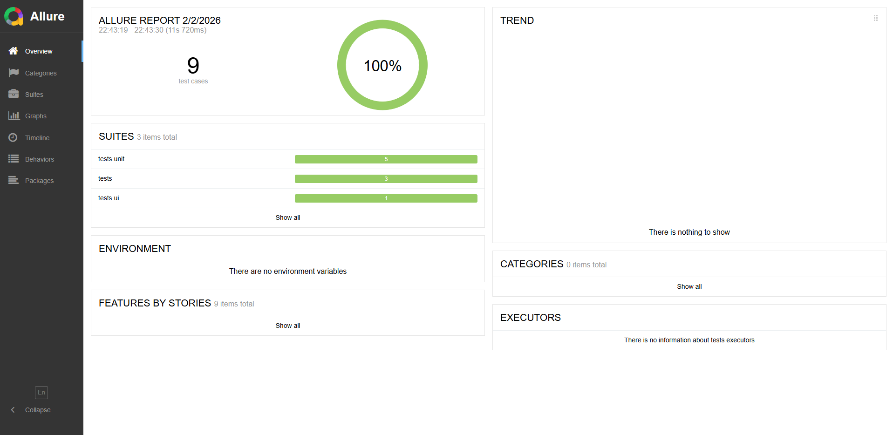

Конечно, Иван! Вот готовый, профессиональный и понятный **`README.md`** для твоего AQA-проекта. Просто скопируй его в корень репозитория и замени `allure-report.png` на реальный скриншот (как только сделаешь).

---

### 📄 `README.md`

```md
# AQA Automation Framework (Python)

Проект демонстрирует full-stack автоматизацию тестирования:  
✅ UI-тесты (Playwright)  
✅ API-тесты (Requests)  
✅ Отчёты (Allure)  
✅ CI/CD (GitHub Actions)

Идеально подходит как портфолио для Junior Automation QA.

---

## 🛠️ Технологии

- **Язык**: Python 3.10+
- **UI-автоматизация**: Playwright (Chromium)
- **Фреймворк тестов**: Pytest
- **API-тестирование**: `requests`
- **Отчёты**: Allure
- **CI/CD**: GitHub Actions
- **VCS**: Git + GitHub

---

## ▶️ Запуск локально

1. Клонируйте репозиторий:
   ```bash
   git clone https://github.com/almazkasimov95/projectPython.git
   cd projectPython
   ```

2. Установите зависимости:
   ```bash
   pip install -r requirements.txt
   ```

3. Установите браузер для Playwright:
   ```bash
   playwright install chromium
   ```

4. Запустите все тесты:
   ```bash
   pytest tests/ --alluredir=./allure-results
   ```

5. Сгенерируйте и откройте отчёт:
   ```bash
   allure serve ./allure-results
   ```

> 💡 Для запуска только UI или API:
> ```bash
> pytest tests/ui/ -v          # только UI
> pytest tests/api/ -v         # только API
> ```

---

## 🧪 Что тестируется?

### UI (через Playwright)
- ✅ Успешный вход (`tomsmith` / `SuperSecretPassword!`)
- ❌ Неверный пароль → проверка ошибки
- Сайт: [https://the-internet.herokuapp.com/login](https://the-internet.herokuapp.com/login)

### API (через Requests)
- ✅ Получение поста по ID
- ✅ Создание нового поста (POST)
- API: [https://jsonplaceholder.typicode.com](https://jsonplaceholder.typicode.com)

---

## 📊 Отчёты

Все тесты генерируют данные для **Allure**.  
Пример отчёта:



> ⚠️ Чтобы увидеть такой же отчёт — сделайте скриншот после `allure serve` и сохраните как `allure-report.png` в корне проекта.

---

## 🔄 CI/CD

Каждый `push` в ветку `main` автоматически запускает тесты через **GitHub Actions**:

[](https://github.com/almazkasimov95/projectPython/actions)

Результаты можно скачать как артефакт и сгенерировать отчёт локально.

---

## 📁 Структура проекта

```
projectPython/
├── pages/                 # Page Object Model
├── tests/
│   ├── ui/                # UI-тесты
│   └── api/               # API-тесты
├── requirements.txt       # Зависимости
├── .github/workflows/     # CI/CD
└── README.md              # Этот файл
```

---

## 📬 Контакт

Готов к работе на позиции **Junior Automation QA Engineer**.  
Резюме и детали — по запросу.
```


